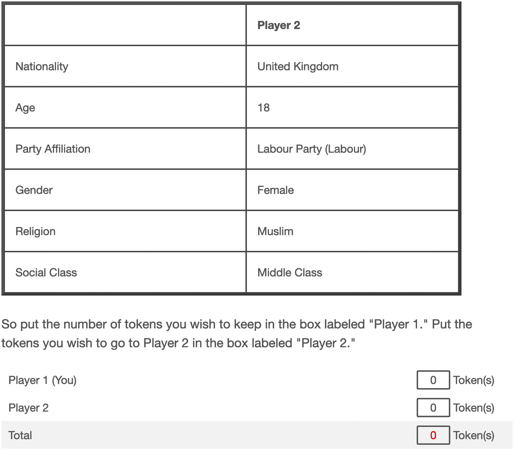

## Introduction {#sec-introduction}

Affective polarization (AP) -- the tendency to favor one's own partisan group while disliking opponents -- has emerged as a defining feature of contemporary democracies [@iyengar2012affect; @iyengar2019origins; @boxell2024cross].
Beyond policy disagreement, AP encompasses social distancing, interpersonal hostility, and discriminatory behavior toward partisan outgroups, raising concerns about democratic cooperation and political stability [@graham2020democracy; @kingzette2021affective; @berntzen2023consequencesofaffective].
Extensive research now documents AP's prevalence across advanced democracies [@wagner2021affective; @reiljan2020fear; @reiljan2024patterns], yet fundamental questions persist about its measurement and psychological foundations.
A particularly consequential ambiguity concerns who counts as "partisan" in empirical analyses: should researchers restrict samples to citizens who self-report feeling attached to a party, or include all those who reveal partisan preferences through vote choice regardless of reported attachment?
This operationalization choice carries major implications for both theory and comparative inference, yet existing research has not systematically examined whether these two groups exhibit equivalent levels of AP.

The partisan identification question matters theoretically because it implicates competing accounts of AP's underlying mechanisms.
Social identity perspectives emphasize subjective attachment as a psychological bond that intensifies emotional investment in political groups, predicting that explicit partisan identifiers should exhibit stronger polarization than those who merely vote without reporting felt attachment [@huddy2015expressive; @mason2018one; @iyengar2015fear].
In contrast, categorization and cue-processing accounts suggest that partisan labels and vote anchors provide sufficient information to generate polarized responses even absent subjective identification [@orr2023affective; @orr2020policy; @dafoe2018information].
Distinguishing these mechanisms has proven difficult because party cues simultaneously signal group membership and ideological content, producing observational equivalence [@orr2023affective].
The partisan type distinction—explicit versus implicit partisanship—provides analytical leverage: systematic differences between these groups would support identity-centric accounts, while equivalent behavior would challenge the assumption that subjective attachment drives polarization.

The measurement stakes are especially high in comparative multiparty research.
Unlike the U.S. two-party system, European electorates contain substantial proportions of voters who express stable partisan preferences yet deny feeling attached to any party.
The prevalence of explicit partisan attachment varies dramatically—ranging from roughly 40% to 80% across European countries in our data—meaning that restricting analyses to self-identified partisans reshapes the population of inference differently in each national context and undermines cross-national comparability [@rollicke2023polarisation; @TorcalComellas2025Operationalizing].
Moreover, widely used AP measures diverge precisely in their treatment of partisans: @reiljan2020fear's Affective Polarization Index (API) focuses on reported identifiers, while @wagner2021affective's spread measure encompasses all respondents, yielding potentially different empirical portraits of polarization [@campos2025new; @CarlinLove2025Measuring].
Without systematic evidence on whether explicit and implicit partisans exhibit equivalent AP, researchers face arbitrary decisions about sample inclusion that may distort substantive conclusions and comparative inference.

Recent theoretical refinements further complicate these issues by distinguishing *vertical* AP—attitudes toward parties and elites—from *horizontal* AP—behavior toward fellow citizens [@klar2018affective; @areal2024verticalvshorizontal; @druckman2019we].
This differentiation matters because different manifestations of polarization may arise from different psychological mechanisms and carry distinct normative implications [@Berntzen2025PoliticalViolence; @campos2025new].
If subjective partisan attachment shapes how citizens feel about *parties* but not how they treat partisan *others* in interpersonal contexts, then vertical and horizontal AP would require separate theoretical accounts.
Testing whether partisan type differentially predicts these two dimensions could reveal whether attachment-driven and categorization-driven processes operate in parallel, with the former dominating party-targeted attitudes and the latter governing citizen-targeted behavior—a possibility existing research has not explored.

We address these challenges by distinguishing *explicit* partisans—respondents who report feeling attached to a party—from *implicit* partisans—those who deny such attachment yet reveal partisan anchors through vote choice.
We term this distinction *partisan type*.
This conceptualization extends classic insights on independents, leaners, and implicit partisan identity [@petrocik2009measuring; @kinder2017neither; @theodoridis2017me; @elliott2024like] to multiparty systems, isolating a theoretical quantity prior work has not directly examined: whether self-reported attachment enhances polarization beyond the effects of partisan categorization alone.
Empirically, we analyze thermometer ratings (vertical AP) and conjoint trust-game experiments (horizontal AP) from 25 European democracies (N≈29,800), applying Bayesian hierarchical models with country-level random effects to estimate AP conditional on partisan type while accounting for respondent clustering and cross-national heterogeneity.

Our (preliminary and exploratory) findings reveal a striking asymmetry.
For vertical AP measured through party thermometer ratings, explicit partisans exhibit systematically and substantially higher polarization than implicit partisans across all 25 countries.
Yet for horizontal AP measured through token allocations in trust games embedding randomized partisan cues, explicit and implicit partisans discriminate identically: both groups show equivalent levels of AP.
This vertical-horizontal divergence challenges theories positing unified mechanisms underlying affective polarization.
Subjective attachment shapes *attitudes toward parties* but does not amplify *behavioral discrimination among citizens*.

Extending these findings, we plan to examine individual-level moderators to identify what drives vertical AP and whether the explicit–implicit gap varies systematically with respondent characteristics. In our future analyses, we will incorporate theoretically relevant covariates -- including ideological extremity, political interest, social identity strength, perceived threat, democratic norms, social trust, and media consumption -- that are available in our data, following insights from existing literature. This approach will allow us to explore whether differences in vertical AP between explicit and implicit partisans are amplified or attenuated among particular subgroups.

These exploratory findings carry several preliminary implications for AP research. First, regarding measurement and population definition, the equivalence of horizontal AP between explicit and implicit partisans suggests that combining vote-anchored and attachment-based respondents is reasonable when estimating behavioral polarization, avoiding unnecessary reductions in external validity. Second, the vertical–horizontal asymmetry indicates that subjective attachment amplifies party-targeted attitudes but does not appear to drive interpersonal discrimination, highlighting the need for multidimensional frameworks distinguishing elite- versus citizen-targeted polarization. Finally, the consistency of this asymmetry across 25 European democracies suggests that these patterns may reflect structural features of multiparty electoral systems rather than country-specific idiosyncrasies, providing a foundation for future analyses of individual-level moderators.

The paper proceeds as follows. @sec-theory reviews theoretical perspectives on partisan identity and affective polarization, develops our conceptualization of partisan type, and derives testable hypotheses distinguishing vertical from horizontal AP. @sec-rd describes the data from 25 European democracies, the measurement strategy applying @reiljan2020fear's API logic consistently across both dimensions, and the Bayesian hierarchical modeling approach. @sec-results-planned outlines the planned presentation of empirical results, @sec-results-descr presents the mentioned preliminary descriptive findings.

## Theory {#sec-theory}

### Origin and Expansion of Affective Polarization Research {#sec-origins}

The contemporary study of political polarization was reshaped by the insight that partisan conflict is driven not only by ideological disagreement but also by social and emotional divisions [@iyengar2012affect].
Early work demonstrated that hostility between partisans intensified even while policy preferences remained comparatively stable [@fiorina2006culture; @fiorina2008polarization], redirecting scholarly attention from ideological distance [@poole1984polarization; @mccarty2006polarized] toward affective orientations between political groups.
Building on social identity approaches, affective polarization (AP) is typically defined as the tendency of individuals to feel warmth toward perceived ingroup members and hostility toward outgroups [@iyengar2015fear; @iyengar2019origins; @IyengarWagner2025Conceptualizing].

Rooted in Social Identity Theory and Self-Categorization Theory [@tajfel1979integrative; @tajfel2004thesocial], AP reflects a broader and well-documented human propensity for ingroup favoritism and outgroup derogation observable even in minimal group settings [@tajfel1971social; @Sherif1961intergroup; @brewer1999psychology].
Political science research focuses on cases where the salient social identity is partisanship [@Huddy2001social; @huddy2015expressive; @mason2015disrespectfully].
Over the past decade, this perspective has generated a large comparative literature documenting the prevalence of AP across advanced democracies [@wagner2021affective; @reiljan2020fear; @reiljan2024patterns; @boxell2024cross], identifying its drivers [@hobolt2024polarizing; @bail2018exposure; @orr2020policy; @mason2015disrespectfully; @tornberg2022digital; @luttig2017authoritarianism], tracing its consequences for democratic attitudes and behavior [@diermeier2019partisan; @berntzen2023consequencesofaffective; @kingzette2021affective; @graham2020democracy; @mcconnell2018economic; @broockman2023doesaffective], examining temporal trends [@iyengar2018strengthening], and evaluating interventions designed to reduce partisan hostility [@adams2023can; @kalla2022voter; @druckman2023does; @mernyk2022correcting].

The rapid growth of this research program has produced substantial empirical knowledge but also conceptual and measurement disputes [@campos2025new; @bakker2024putting; @IyengarWagner2025Conceptualizing; @CarlinLove2025Measuring].
Scholars increasingly recognize that the concept encompasses multiple related phenomena and that different operationalizations can yield divergent conclusions about its magnitude, distribution, and implications.
Consequently, cumulative knowledge now depends less on documenting whether AP exists than on clarifying what precisely is being measured and for whom theoretical claims apply.

### Core Debates and Conceptual Refinements {#sec-core-debates}

Early debates centered on whether polarization should be understood as a state or a process and whether its democratic consequences are uniformly harmful or conditional [@kingzette2021affective; @moore2020exaggerated; @westwood2022current].
More recent work emphasizes that different manifestations of AP may have distinct normative implications and psychological origins [@Berntzen2025PoliticalViolence; @broockman2023doesaffective; @voelkel2023interventions].
Three major refinements structure the contemporary literature.

First, target differentiation.
Scholars distinguish vertical polarization—affect toward parties and elites—from horizontal polarization—affect and behavior toward fellow citizens [@klar2018affective; @harteveld2021ticking; @druckman2019we; @areal2024verticalvshorizontal].
Vertical AP can further target parties or leaders [@reiljan2024patterns; @Torcal2022affective], while horizontal AP concerns interpersonal discrimination.
Because elite-directed hostility and citizen-directed behavior may arise from different mechanisms, conflating them risks obscuring causal relationships.

Second, manifestation differentiation.
Research differentiates attitudinal AP, typically measured with feeling thermometers or social distance scales, from behavioral AP, measured through economic allocation decisions or real interactions [@druckman2019we; @CarlinLove2025Measuring; @iyengar2015fear].
These measures need not align: citizens may express dislike without discriminating behaviorally, or discriminate without reporting strong hostility.

Third, operationalization choices. Measurement depends on defining partisan groups.
Scholars must determine how to identify partisans (attachment vs vote choice), whether individuals may hold multiple ingroups [@kekkonen2021affective; @kekkonen2022puzzles; @bantel2023camps], how to define outgroups (least-liked party vs average opponent) [@wagner2021affective], and whether to include non-partisans in analysis [@rollicke2023polarisation].
These decisions reshape empirical findings rather than merely refining them.

Together, these developments imply that AP is not a single phenomenon but a family of related outcomes whose interpretation depends heavily on conceptual and measurement choices [@campos2025new; @IyengarWagner2025Conceptualizing].

### Extending Affective Polarization to Multiparty Systems {#sec-extending-AP}

These challenges intensify in multiparty democracies [@rollicke2023polarisation; @TorcalComellas2025Operationalizing]. In two-party systems, ingroup and outgroup boundaries are clear.
In fragmented party systems, however, several ambiguities emerge.

First, it is unclear what constitutes the ingroup.
Researchers variously define it as the most-liked party, multiple parties, or ideological blocs [@kekkonen2021affective; @kekkonen2022puzzles; @bantel2023camps; @reiljan2021ideological]. Second, identifying membership can rely on subjective attachment or vote choice [@wagner2021affective; @reiljan2020fear].
Third, defining outgroups may involve the least-liked party or the average evaluation of all opponents [@wagner2021affective].
Finally, many citizens lack explicit partisan identification, raising the question of whether they belong in the population of inference [@garzia2023affective].

Existing measurement strategies address these issues differently.
Some approaches assign each respondent a single ingroup and calculate polarization relative to all outparties [@reiljan2020fear; @hahm2024divided]; others measure dispersion in party evaluations and include non-identifiers [@wagner2021affective]; still others allow multiple ingroups [@kekkonen2021affective; @kekkonen2022puzzles].
Because explicit partisan attachment varies substantially across European countries, these decisions affect cross-national comparability. Restricting analyses to self-identified partisans can approximate the electorate in countries with high identification rates but represent only a minority in others.
As a result, identical operationalizations may imply different target populations across cases.

[Table of comparative studies and ingroup strategies]

Moreover, attachment questions themselves may capture different psychological phenomena depending on party system institutionalization and stability [@garzia2023affective].
Comparative research typically assumes equivalence, yet this assumption is rarely evaluated.

### Partisan Type, Population of Inference, and Research Contribution {#sec-contribution}

To address these comparability and interpretation problems, we distinguish between respondents who report attachment to a party and those who deny attachment but reveal a partisan anchor through vote choice. We refer to these categories as partisan types: explicit and implicit partisans. The distinction serves primarily as a consistent terminology allowing comparable analysis across contexts rather than a novel theoretical construct.

The distinction matters because it directly affects the population of inference. If the proportion of explicit and implicit identifiers varies across countries, analyses limited to explicit identifiers describe fundamentally different electorates across cases. Consequently, comparative conclusions about AP may depend as much on sampling decisions as on political behavior.

Beyond measurement, the comparison offers leverage for adjudicating competing theoretical accounts of polarization. Social identity theories emphasize subjective attachment as a psychological bond that intensifies emotional investment in political groups [@huddy2015expressive; @mason2018one; @huddy2013group; @west2022partisanship]. In contrast, categorization and cue-processing perspectives suggest that partisan labels and vote anchors alone provide sufficient information to generate polarized responses, even absent felt attachment [@orr2023affective; @orr2020policy; @dafoe2018information; @tajfel1971social].

We therefore compare explicit and implicit partisans across two dimensions of AP:
(1) vertical attitudinal polarization toward parties and
(2) horizontal behavioral discrimination toward citizens.
We further examine whether individual characteristics moderate these relationships. The analysis of individual-level drivers remains exploratory; covariate selection will be guided by existing research on ideological extremity [@abramowitz2006exploring; @abramowitz2008ispolarization], engagement [@luttig2017authoritarianism], social identity strength [@mason2015disrespectfully; @mason2018one], perceived threat [@huddy2015expressive], democratic norms [@graham2020democracy], social trust, and media consumption [@bail2018exposure; @tornberg2022digital].

### Hypotheses {#sec-hypotheses}

We evaluate competing explanations of AP by comparing explicit and implicit partisans across vertical (attitudinal) and horizontal (behavioral) domains. 
Social identity accounts emphasize subjective attachment as a psychological bond that intensifies affective investment in political groups [@huddy2015expressive; @mason2018one], whereas categorization accounts argue that partisan labels and vote anchors alone suffice to generate polarized responses [@orr2023affective; @dafoe2018information].

#### Vertical (Attitudinal) AP

If attachment creates emotional investment in political objects, explicit identifiers should evaluate ingroup and outgroup parties more differently than implicit identifiers.

$\text{H}_{1a}$ (Identity mechanism): Explicit partisans exhibit higher vertical AP than implicit partisans.

If partisan categorization alone activates evaluative schemas, attachment adds little beyond knowing one's partisan anchor [@orr2023affective].

$\text{H}_{1b}$ (Categorization mechanism):
Explicit and implicit partisans exhibit equivalent vertical AP.

#### Horizontal (Behavioral) AP

If identity strength drives discriminatory behavior toward political opponents, explicit identifiers should favor copartisans more strongly in interpersonal decisions [@huddy2015expressive; @iyengar2015fear].

$\text{H}_{2a}$ (Identity mechanism):
Explicit partisans exhibit higher horizontal AP than implicit partisans.

If categorization and inferred alignment are sufficient to generate intergroup bias [@tajfel1971social; @Sherif1961intergroup], behavioral discrimination should not depend on subjective attachment.

$\text{H}_{2b}$ (Categorization mechanism):
Explicit and implicit partisans exhibit equivalent horizontal AP.

#### Individual-Level Moderation

Identity-based mechanisms imply that affective investment intensifies among individuals whose political orientations are psychologically consolidated [@mason2015disrespectfully; @west2022partisanship].

$\text{H}_3$: The explicit–implicit gap in vertical polarization is larger among ideologically extreme and politically engaged respondents.

If behavioral discrimination primarily follows categorization rather than identity strength, these moderators should not alter behavioral differences.

$\text{H}_4$: Individual-level moderators affect vertical but not horizontal differences between partisan types.

## Research Design {#sec-rd}

### Data {#sec-data}

We analyze survey data from 25 European democracies collected as part of a large-scale conjoint experiment fielded in 2019 (N ≈ 29,800 respondents) [@hahm2024divided]. The study was designed to examine partisan discrimination across diverse party systems, combining standard survey measures of political attitudes with behavioral games embedding randomized partisan cues. The cross-national scope -- spanning established Western European democracies, Southern European countries, and newer Central and Eastern European democracies -- provides substantial variation in party system characteristics, democratic consolidation, and patterns of partisan attachment.

Each respondent completed: (1) standard demographic and political attitude batteries, including party thermometer ratings and a partisan attachment item; (2) vote choice questions; and (3) behavioral games (dictator and trust games) in which they allocated resources to profiles randomly assigned partisan and demographic attributes. The hierarchical structure of the data -- with multiple evaluations nested within respondents, who are nested within countries -- requires multilevel modeling to appropriately account for clustering and estimate cross-national heterogeneity.

### Measuring Vertical Affective Polarization: Party Thermometer Ratings {#sec-vertical-measure}

Vertical (attitudinal) AP is measured using feeling thermometer ratings toward political parties. Respondents evaluated all major parties in their country on a 0 (dislike) to 100 (like) scale. We rescale this measure to a 0–10 scale so that the outcome space matches the horizontal AP token allocation measure, facilitating direct comparison across the two dimensions.

The hierarchical structure generates multiple observations per respondent: each individual $i$ in country $c$ provides ratings $r$ for multiple parties. We construct a binary indicator $\text{CoPartisan}_{ric}$ that equals 1 when the rated party matches respondent $i$'s partisan anchor and 0 otherwise. This operationalization allows us to estimate AP as the difference between ingroup affect (ratings of one's own party) and average outgroup affect (ratings of all other parties), directly implementing @reiljan2020fear's AP Index (API) logic within a regression framework.

### Measuring Horizontal Affective Polarization: Token Allocation in Behavioral Games {#sec-horizontal-measure}

Horizontal (behavioral) AP is measured through token allocations in conjoint experiments embedding partisan cues [@hahm2024divided]. Respondents participated in dictator and trust games where they allocated tokens to profiles describing hypothetical citizens. Each profile included randomized attributes: partisan affiliation, age, social class, gender, religion, and EU position. The randomization ensures that partisan cues are orthogonal to other profile characteristics, isolating the causal effect of copartisanship on resource allocation.

In the dictator game, respondents divided 10 tokens between themselves and a partner. In the trust game, respondents decided how many tokens (0–10) to send to a partner, with sent tokens tripled and the partner choosing how many to return. Both games measure behavioral discrimination: the extent to which respondents favor copartisans over outpartisans in resource allocation decisions.

As with thermometer ratings, the design generates multiple observations per respondent: each individual $i$ evaluated multiple profiles $r$. We construct $\text{CoPartisan}_{ric} = 1$ when the profile's party affiliation matches respondent $i$'s partisan anchor, and 0 otherwise. This parallel operationalization allows direct comparison of vertical and horizontal AP using identical analytical frameworks.

### Partisan Type: Explicit Versus Implicit Partisans {#sec-partisan-type}

Our key explanatory variable distinguishes respondents by partisan type. The survey first asked: “Do you consider yourself to be close to any particular political party? If so, which party do you feel close to?” Respondents indicating closeness to any party are classified as explicit partisans ($\text{Type}_i = 1$). For these individuals, the named party defines the respondent’s partisan anchor. This group comprises roughly 18,000 respondents in our sample.

Respondents who selected the option indicating no attachment to any party were subsequently evaluated using multiple electoral preference items capturing both retrospective and prospective behavior: vote intention and reported vote choice (including alternative and earlier election recall items). We employ a recall-maximizing strategy: if a respondent reported any party preference across these measures, that party is assigned as the respondent’s partisan anchor and the respondent is classified as an implicit partisan ($\text{Type}_i = 0$). These individuals deny subjective identification but reveal a behavioral partisan anchor through electoral preference (approximately 6,000 respondents).

Respondents who neither reported party attachment nor indicated any party in any vote item are classified as non-partisans (approximately 3,900 respondents). Because they lack a defensible partisan anchor, they cannot be assigned copartisan–outpartisan relationships and are therefore excluded from analyses requiring such comparisons.

For explicit and implicit partisans alike, the identified party—whether derived from attachment or electoral preference—serves as the partisan anchor defining copartisan versus outpartisan distinctions in subsequent evaluations. This procedure distinguishes subjective identification from behavioral anchoring while maintaining a consistent reference point for measuring AP across respondents.

Importantly, the distribution of partisan types varies substantially across countries. @fig-impl-expl-distribution visualizes this cross-national heterogeneity in partisan attachment and behavioral anchoring. The share of explicit partisans ranges from approximately 85% of respondents in Denmark to about 41% in Latvia, while implicit partisans show the inverse pattern, varying from roughly 41% in Latvia to 8% in Denmark. Non-partisans also differ markedly across contexts, ranging from 23% in Croatia to 6% in Estonia.

These patterns indicate that both reported attachment and overall partisan composition differ strongly across national contexts. Consequently, identical sampling decisions -- such as restricting analyses to self-reported identifiers -- would generate different populations of inference across countries. This cross-national variation motivates our comparison of AP across partisan types rather than focusing exclusively on explicit identifiers.



### Analytical Strategy {#sec-methods}

We (plan to) employ Bayesian hierarchical models to estimate AP as a function of partisan type, progressively building complexity to balance interpretability with inferential rigor.
Our approach unfolds in three stages: first, we introduce the core linear predictor that defines AP and connects directly to our hypotheses.
Second, we embed this predictor within a multilevel structure enabling cross-national inference.
Third, we extend the model to examine individual-level moderators of partisan type effects.
This progression maintains a constant estimand -- the ingroup-outgroup evaluation gap -- while progressively incorporating the nested data structure and testing conditional relationships.

#### The Linear Predictor: Defining Affective Polarization {#sec-linear-predictor}

At its core, our analysis asks whether respondents evaluate copartisans differently from outpartisans, and whether this difference differs among partisan types. The basic model specification is:

$$
\text{Outcome}_{ric} = \alpha + \beta_1 \cdot \text{CoPartisan}_{ric} + \beta_2 \cdot \text{Type}_i + \beta_3 \cdot (\text{CoPartisan}_{ric} \times \text{Type}_i)
$$

where $r$ indexes evaluations (party ratings or behavioral allocations), $i$ indexes respondents, and $c$ indexes countries.
The outcome is either a feeling thermometer rating (vertical AP) or token allocation in the behavioral task (horizontal AP).
The indicator $\text{CoPartisan}_{ric} = 1$ when the evaluated party or profile matches respondent $i$'s partisan anchor, and $\text{Type}_i = 1$ for explicit partisans versus 0 for implicit partisans.

This specification defines AP as a derived quantity of interest: the expected difference in evaluations between copartisans and outpartisans.
Formally:

$$
\text{AP}_t = \mathbb{E}[\text{Outcome} \mid \text{CoPartisan}=1, \text{Type}=t] - \mathbb{E}[\text{Outcome} \mid \text{CoPartisan}=0, \text{Type}=t]
$$

From the linear predictor, this translates to $\text{AP}_{\text{implicit}} = \beta_1$ for implicit partisans and $\text{AP}_{\text{explicit}} = \beta_1 + \beta_3$ for explicit partisans.
The central hypothesis test therefore concerns $\beta_3$: identity-based theories predict $\beta_3 > 0$, indicating that explicit attachment amplifies polarization, while categorization-based theories predict $\beta_3 \approx 0$, indicating that partisan anchors alone suffice to generate the ingroup-outgroup gap.
We apply this framework separately to vertical and horizontal outcomes, enabling direct comparison of partisan type effects across attitudinal and behavioral polarization.

This operationalization maintains consistency with @reiljan2020fear's AP Index -- calculating polarization as ingroup affect minus average outgroup affect -- while embedding the comparison within a regression framework that isolates the role of subjective attachment.
The binary copartisan indicator ensures that AP reflects the difference between a single ingroup evaluation and the average across all outgroup evaluations, exactly paralleling the API logic but extending it to both thermometer ratings and behavioral allocations.

#### Multilevel Structure for Cross-National Inference {#sec-multilevel-structure}

Because evaluations are nested within respondents and respondents within countries, we estimate the linear predictor within a three-level hierarchical model:

$$
\begin{aligned}
\text{Outcome}_{ric} = &(\alpha + \alpha_i + \alpha_c) \\
&+ (\beta_1 + \beta_{1c}) \cdot \text{CoPartisan}_{ric} \\
&+ (\beta_2 + \beta_{2c}) \cdot \text{Type}_i \\
&+ (\beta_3 + \beta_{3c}) \cdot (\text{CoPartisan}_{ric} \times \text{Type}_i) \\
&+ \varepsilon_{ric}
\end{aligned}
$$

where $\alpha_i \sim \mathcal{N}(0, \sigma_{\text{respondent}}^2)$ represents respondent-specific intercepts accounting for repeated measures within individuals, $\alpha_c \sim \mathcal{N}(0, \sigma_{\text{country}}^2)$ represents country-specific intercepts, and $\beta_{1c}$, $\beta_{2c}$, $\beta_{3c}$ represent country-varying slopes for the copartisan effect, type effect, and their interaction.
Residual variation $\varepsilon_{ric} \sim \mathcal{N}(0, \sigma^2)$ captures within-respondent noise across evaluations.

This hierarchical specification serves two purposes.
First, it appropriately accounts for clustering: standard errors reflect uncertainty at all levels of the data structure, avoiding anti-conservative inference.
Second, it enables estimation of both population-average and country-specific effects.
Population-average AP is recovered by marginalizing over random effects, yielding $\text{AP}_t = \beta_1 + t \cdot \beta_3$, which answers whether explicit partisans polarize more than implicit partisans on average across European democracies.
Country-specific AP is estimated by conditioning on country-level random effects, yielding $\text{AP}_{c,t} = (\beta_1 + \beta_{1c}) + t \cdot (\beta_3 + \beta_{3c})$, which reveals whether the explicit-implicit gap varies systematically across party systems.

The multilevel approach is particularly important given the substantial cross-national variation in explicit partisan prevalence documented in @fig-impl-expl-distribution.
If partisan type effects vary systematically with party system characteristics -- for instance, if subjective attachment matters more in institutionalized party systems -- the country-varying slopes will capture this heterogeneity.
Conversely, if the vertical-horizontal asymmetry in partisan type effects holds consistently across all 25 countries, this would suggest a broadly shared mechanism operating across diverse institutional contexts.
We assess this through posterior distributions of $\beta_{3c}$, testing whether country-specific deviations cluster around zero or exhibit systematic patterns.

#### Individual-Level Moderators of Partisan Type Effects {#sec-moderators}

To examine whether the explicit–implicit gap in vertical AP varies with respondent characteristics, we extend the linear predictor to include individual-level moderators and their interactions with partisan type:

$$
\begin{aligned}
\eta_{ric} = &\alpha + \beta_1 \cdot \text{CoPartisan}_{ric} + \beta_2 \cdot \text{Type}_i + \beta_3 \cdot \text{Covariate}_i \\
&+ \beta_4 \cdot (\text{CoPartisan}_{ric} \times \text{Type}_i) \\
&+ \beta_5 \cdot (\text{CoPartisan}_{ric} \times \text{Covariate}_i) \\
&+ \beta_6 \cdot (\text{Type}_i \times \text{Covariate}_i) \\
&+ \beta_7 \cdot (\text{CoPartisan}_{ric} \times \text{Type}_i \times \text{Covariate}_i)
\end{aligned}
$$

The key parameter is $\beta_7$, which evaluates whether the partisan-type difference in AP ($\beta_4$) varies systematically across individuals.
Substantively, this parameter indicates whether the explicit–implicit gap depends on respondent characteristics rather than representing a uniform population-level difference.

For any given value of a covariate, the partisan-type gap in AP is

$$
\Delta \text{AP} = \beta_4 + \beta_7 \cdot \text{Covariate}.
$$

We will therefore interpret moderation using simulated conditional marginal effects derived from the posterior distribution, tracing how the explicit–implicit difference changes across the observed covariate range and identifying regions where the gap is credibly positive, negative, or indistinguishable from zero.

At the present stage, the specific covariates to be included are not fixed.
Their selection will be guided by prior research on correlates of AP and by data availability across countries.
Models will be estimated separately for vertical (thermometer) and horizontal (behavioral allocation) outcomes to evaluate whether moderation appears in attitudinal polarization but not behavioral discrimination.

The moderator specification can be combined with the multilevel structure introduced above, allowing effects to vary across countries.
For clarity, we begin with pooled moderator models that estimate average patterns across contexts; country-varying moderator effects constitute a planned extension examined in supplementary analyses.

#### Summary {#sec-strategy-summary}

Our three-stage analytical strategy maintains a constant estimand -- AP as the ingroup-outgroup evaluation gap—while progressively improving inferential realism.
Stage 1 defines AP through a simple interaction-based linear predictor that connects directly to competing theoretical predictions about partisan type effects.
Stage 2 embeds this predictor within a hierarchical model accounting for data structure and enabling cross-national inference about heterogeneity in partisan type effects.
Stage 3 extends the framework to test whether individual characteristics moderate the explicit-implicit gap, distinguishing contexts where subjective attachment matters most.
This progression balances transparency, interpretability, and statistical rigor, allowing us to adjudicate between identity-based and categorization-based accounts of AP across both vertical and horizontal dimensions.

## Planned Results Structure {#sec-results-planned}

### Vertical AP

- Figure/Panel with pooled EU25-wide and country specific AP by type 

### Horizontal AP

- Figure/Panel with pooled EU25-wide and country specific AP by type 

### Individual level moderation

- Marginal/Conditional effect figure(s), with covariate values on x-axis, effect on AP on y axis, different lines (and intervals) by type, separate panels for vertical/horiztonal AP

- figure with panels by country? Unsure yet

## Exploratory descriptive results {#sec-results-descr}

### Pooled vertical/attitudinal AP measures by type



-> across measures, explicit partisans systematically higher AP than implicit

-> Non-partisans (which can be included in Wagner measures) systematically less polarized

-> restricting sample to explicit partisans (identifiers) yields higher aggregate AP 

### Country-level vertical/attitudinal AP measures by type



-> pattern roughly consistent across countries (i.e., blue -> green -> orange)

-> cross-national variation in terms of magnitudes and within-country differences

-> With the varying country-specific distributions (@fig-impl-expl-distribution) in mind, AP estimates for all partisans (total) shift either close to that of explicit partisans (e.g. Denmark, Greece, Sweden) or stay centered between estimates for explicit and implicit partisans (e.g. Austria, Bulgaria, Ireland)

### Pooled horizontal/behavioral AP measures by type



-> unlike in attitudinal AP, intervals for explicit and implicit overlap, hence no systematic difference 

-> preliminary interpretation: accordign to data explicit attachement does not matter for behavioral AP 

### Country-level horizontal/behavioral AP measures by type



-> pooled results generally consistent across countries

-> no systematic difference in behavioral AP between explicit and implicit

-> "strongest tendency" in Denmark, Lithuania and Portugal

-> otherwise almost no difference

-> estimate for total partisans drawn to explicit partisans (due to conjoint setup)

## Limitations

This is so far mainly a collection of limitations for myself in order to not forget them in the end.

- Party-targeted attitudinal measures only

The attitudinal analysis relies exclusively on party-targeted thermometer ratings. It does not include direct citizen-targeted affect measures, limiting conclusions about horizontal AP at the attitudinal level.

- Assumption underlying party-size weighting

Weighting by electoral party size—common in the literature—implicitly assumes that the probability of encountering partisans is proportional to vote share. This may not hold if certain parties (e.g., radical challenger parties) are socially more or less visible than their electoral strength suggests.

- Cross-sectional design (2019)

The data capture a specific pre-pandemic political context and allow inference only about the level (state) of AP at that point in time. The design does not permit conclusions about temporal dynamics or trends.

- External validity of the experimental setting

Although the conjoint experiment approximates horizontal, citizen-level interactions, it remains an artificial setting. In real-world encounters, identities are rarely presented as explicit labels. Instead, they are inferred through cues and cognitive processes. This limits the direct generalizability of experimentally induced identity effects to everyday social interactions.

## Conclusion

tbd

\singlespacing

## References

::: {#refs}
:::

## Appendix {.appendix}

### Sample descriptives {.appendix}







### Survey item wording (English version) {.appendix}

| Variable | Question |
|:---|:--------------|
|  Party Attachement | Do you consider yourself to be close to any particular political party? If so, which party do you feel close to? |
|  Vote Intention | Which party will you give your 1st preference vote in this [2019 European] election? |
|  Vote Choice | Which party did you give your 1st preference vote to in this [2019 European] election? |
|  Feeling Thermometer |  We would like to get your feelings toward some political parties and political leaders in the news these days. Below there is a list of parties and people. I'd like you to rate them using something we call the feeling thermometer. Ratings between 50 degrees and 100 degrees mean that you feel favorable and warm toward the party or person. Ratings between 0 degrees and 50 degrees mean that you don't feel favorable toward the party or person and that you don't care too much for that party or person. You would rate the political party or the person at the 50 degree mark if you don't feel particularly warm or cold toward the person. |
: Survey item wording (English version) {#tbl-survey-items}

### Experimental setup {.appendix}

Before the behavioral games, @hahm2024divided presented respondents a short background information overview and instructions. For the dictator game, these were: *This game is played by pairs of individuals.* *Each pair is made up of a Player 1 and a Player 2.* *Each player will have some information about the other player, but you will not be told who the other players are during or after the experiment.* *The game is conducted as follows: A sum of 10 tokens will be provisionally allocated to Player 1 at the start of each round.* *Player 1 will then decide how much of the 10 tokens to offer to Player 2.* *Player 1 could give some, all, or none of the 10 tokens.* *Player 1 keeps all tokens not given to Player 2.* *Player 2 gets to keep all the tokens Player 1 offers.* *You will play this game three times with three different people.* In the trust game, the provided information and instruction were: *This game is played by pairs of individuals.* *Each pair is made up of a Player 1 and a Player 2.* *Each player will have some information about the other player, but you will not be told who the other players are during or after the experiment.* *Each player will receive 10 tokens.* *Player 1 then has the opportunity to give a portion of his or her 10 tokens to Player 2.* *Player 1 could give some, all, or none of the 10 tokens.* *Whatever amount Player 1 decides to give to Player 2 will be tripled before it is passed on to Player 2.* *Player 2 then has the option of returning any portion of this tripled amount to Player 1.* *Then, the game is over.* *Player 1 receives whatever he or she keeps from the original 10 tokens, plus anything returned to him or her by Player 2. Player 2 receives their original 10 tokens, plus whatever he or she keeps after returning any portion of the tripled amount to Player 1.* *You will play this game three times, with three different people.* *The more tokens you obtain, the more successful you will be.*

In both games respondents were shown a tabular overview of Player 2 after the instructions. @fig-example-profile shows an example of such a profile along with the interface respondents were provided to assign the 10 tokens. Each round, a new profile was displayed to respondents.

{#fig-example-profile}

### Distribution of Y {.appendix}





### Robustness {.appendix}

