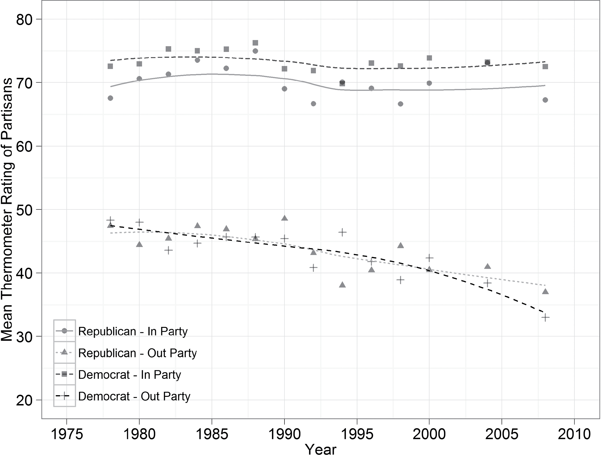
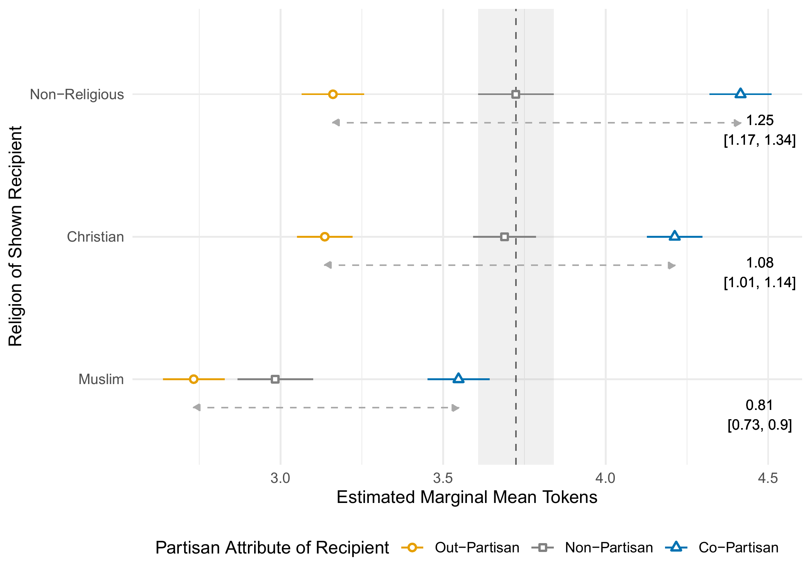
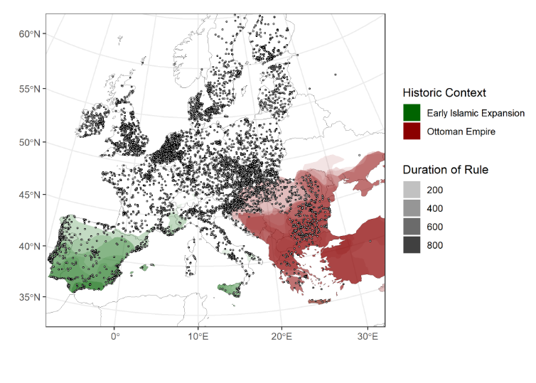

```{r}
#| label: setup
#| include: false

library(ggplot2)
library(dplyr)
library(patchwork)

navy <- "#003056"
accent <- "#DE7E50"
grey1 <- "#B9C2CA"
grey2 <- "#7F94A5"

theme_schematic <- function(base = 13) {
  theme_void(base_size = base) +
    theme(
      plot.title = element_text(
        colour = navy,
        face = "bold",
        hjust = 0.5,
        size = rel(1.05),
        margin = margin(b = 3)
      ),
      plot.subtitle = element_text(
        colour = grey2,
        hjust = 0.5,
        size = rel(0.85),
        margin = margin(b = 5)
      ),
      plot.background = element_rect(fill = "white", colour = NA),
      legend.position = "none",
      plot.margin = margin(4, 6, 4, 6)
    )
}
```

## What Do We Mean When We Talk About Polarization?

{width="100%"}

 -- Trilateral Summer Academy 2026, uOttawa



::: {.notes}
Thanks very much for having me. The paper behind this talk is joint work with Thomas König.

The title is a question and I mean it as one. Over the next half hour I want to convince you that polarization is not one thing -- that it is a family of distinct phenomena sharing a name, and that which one you measure decides what you find.

I have built this for people who have not read this literature, so please stop me if anything is unclear.
:::

------------------------------------------------------------------------

## About me

::: {.columns}
::: {.column width="58%"}
- Born in Mainz, finished high school in 2018
- Helped logistically at an earlier version of (back then a bilateral) summer institute in 2018
- B.Ed. History & Pol. Science, M.A. Pol Science, since 2025 PhD at Uni Mannheim
- The building I actually work in:
:::

::: {.column width="42%"}
::: {.about-fig}

:::
:::
:::

------------------------------------------------------------------------

## Agenda

1. The concept -- a family, not a thing
2. From political to affective polarization
3. Social identity theory
4. Measuring affective polarization
5. Affective polarization in Europe -- @hahm2024divided
6. Takeaways
7. Where I go from here -- ongoing projects (if time)

::: {.notes}
Here is the route. The concept first, which is really a family of concepts. Then the move that dominates the field today: from whether positions diverge to how people feel about each other. Third, the theory that explains why feelings run ahead of disagreement. Fourth, measurement -- the heart of the talk. Fifth, what affective polarization looks like in Europe on a behavioral measure rather than the usual thermometer. Then the takeaways. And if there is time at the end, a few slides on my own ongoing projects.

The central claim, out loud: polarization is not one thing. It is a family of distinct phenomena that share a name, and which one you measure decides what you find.

My one goal for you. By the end I want you to be suspicious of any sentence of the form "polarization is increasing" that does not specify *what kind*.
:::

# The Concept

## A word borrowed from physics

- Physics: polarization is the *orientation* of a wave
- Original meaning: alignment, orientation, separation
- Nothing about conflict or hostility -- social science supplied that

```{r}
#| label: schematic-physics
#| fig-width: 8
#| fig-height: 3.5
#| fig-align: center
#| out-width: "80%"

ang <- seq(0, 165, by = 15) * pi / 180
pre <- do.call(
  rbind,
  lapply(c(0.55, 1.10), function(cx) {
    data.frame(x = cx, dx = 0.17 * cos(ang), dy = 0.52 * sin(ang))
  })
)
post <- data.frame(x = c(2.35, 2.80, 3.25))
grating <- data.frame(gx = seq(1.79, 1.96, length.out = 5))

p_light <- ggplot() +
  geom_segment(
    aes(x = 0.15, xend = 3.45, y = 0, yend = 0),
    colour = grey1,
    linewidth = 0.35,
    linetype = "22"
  ) +
  geom_segment(
    data = pre,
    aes(x = x - dx, xend = x + dx, y = -dy, yend = dy),
    colour = grey1,
    linewidth = 0.7
  ) +
  geom_rect(
    aes(xmin = 1.75, xmax = 2.00, ymin = -0.88, ymax = 0.88),
    fill = "white",
    colour = navy,
    linewidth = 0.9
  ) +
  geom_segment(
    data = grating,
    aes(x = gx, xend = gx, y = -0.82, yend = 0.82),
    colour = navy,
    linewidth = 0.4
  ) +
  geom_segment(
    data = post,
    aes(x = x, xend = x, y = -0.52, yend = 0.52),
    colour = navy,
    linewidth = 1.2
  ) +
  annotate(
    "text",
    x = 0.83,
    y = -1.12,
    label = "unpolarized",
    colour = grey2,
    size = 3.2
  ) +
  annotate(
    "text",
    x = 1.88,
    y = 1.12,
    label = "filter",
    colour = navy,
    size = 3.2
  ) +
  annotate(
    "text",
    x = 2.80,
    y = -1.12,
    label = "polarized",
    colour = navy,
    size = 3.2
  ) +
  coord_fixed(xlim = c(0.1, 3.5), ylim = c(-1.35, 1.35)) +
  labs(title = "Light: aligned in one plane", subtitle = " ") +
  theme_schematic()

fline <- data.frame(x = -0.78, y = 0.30, xend = 0.78, yend = 0.30)
flineb <- data.frame(x = -0.78, y = -0.30, xend = 0.78, yend = -0.30)
curv <- c(-0.45, -0.80, -1.15)

p_mag <- ggplot() +
  lapply(curv, function(cc) {
    geom_curve(
      data = fline,
      aes(x = x, y = y, xend = xend, yend = yend),
      curvature = cc,
      colour = grey1,
      linewidth = 0.5
    )
  }) +
  lapply(curv, function(cc) {
    geom_curve(
      data = flineb,
      aes(x = x, y = y, xend = xend, yend = yend),
      curvature = -cc,
      colour = grey1,
      linewidth = 0.5
    )
  }) +
  geom_rect(
    aes(xmin = -0.90, xmax = 0, ymin = -0.30, ymax = 0.30),
    fill = navy,
    colour = NA
  ) +
  geom_rect(
    aes(xmin = 0, xmax = 0.90, ymin = -0.30, ymax = 0.30),
    fill = accent,
    colour = NA
  ) +
  annotate(
    "text",
    x = -0.45,
    y = 0,
    label = "N",
    colour = "white",
    fontface = "bold",
    size = 4.6
  ) +
  annotate(
    "text",
    x = 0.45,
    y = 0,
    label = "S",
    colour = "white",
    fontface = "bold",
    size = 4.6
  ) +
  coord_fixed(xlim = c(-1.35, 1.35), ylim = c(-1.35, 1.35)) +
  labs(title = "Magnet: two poles", subtitle = " ") +
  theme_schematic()

p_light | p_mag
```

::: {.notes}
Let me start somewhere that is not political science at all.

The word comes from physics, where it describes the orientation of a wave. Unpolarized light vibrates in every plane at once, and a filter aligns it to one. Or think of a magnet: charge separated towards two poles.

What is in that concept is alignment and separation. What is not in it is conflict. Polarized light waves are not fighting each other, and there is no pathology in a magnet. Social science added all of that.

So we imported a word about alignment and turned it into a word about conflict, then started arguing about whether it is getting worse without agreeing on what it is.
:::

------------------------------------------------------------------------

## Polarization is a family of concepts

- Broadest usage: alignment, separation, sorting, divergence
- Four mathematically distinct things share the name
- They can move in **opposite directions in the same data**

```{r}
#| label: schematic-four-dists
#| fig-width: 8
#| fig-height: 3.3
#| fig-align: center
#| out-width: "70%"

xs <- seq(-5.5, 5.5, length.out = 400)

base_p <- function(d, title, sub) {
  ggplot(d, aes(x, y, colour = g, group = grp)) +
    geom_hline(yintercept = 0, colour = grey1, linewidth = 0.3) +
    geom_line(linewidth = 0.9) +
    scale_colour_manual(values = c(before = grey1, after = navy)) +
    labs(title = title, subtitle = sub) +
    theme_schematic()
}

d_disp <- rbind(
  data.frame(x = xs, y = dnorm(xs, 0, 1.0), g = "before", grp = "1"),
  data.frame(x = xs, y = dnorm(xs, 0, 2.3), g = "after", grp = "2")
)

d_bim <- rbind(
  data.frame(x = xs, y = dnorm(xs, 0, 1.6), g = "before", grp = "1"),
  data.frame(
    x = xs,
    y = 0.5 * dnorm(xs, -2.1, 0.8) + 0.5 * dnorm(xs, 2.1, 0.8),
    g = "after",
    grp = "2"
  )
)

d_dist <- rbind(
  data.frame(x = xs, y = dnorm(xs, -0.7, 0.9), g = "before", grp = "1"),
  data.frame(x = xs, y = dnorm(xs, 0.7, 0.9), g = "before", grp = "2"),
  data.frame(x = xs, y = dnorm(xs, -2.4, 0.9), g = "after", grp = "3"),
  data.frame(x = xs, y = dnorm(xs, 2.4, 0.9), g = "after", grp = "4")
)

set.seed(7)
n <- 110
aa <- rnorm(n)
d_sort <- rbind(
  data.frame(x = aa, y = rnorm(n), g = "before"),
  data.frame(x = aa, y = 0.9 * aa + sqrt(1 - 0.81) * rnorm(n), g = "after")
)

p_sort <- ggplot(d_sort, aes(x, y, colour = g)) +
  geom_point(size = 0.75, alpha = 0.8) +
  scale_colour_manual(values = c(before = grey1, after = navy)) +
  labs(title = "Sorting", subtitle = "divides become correlated") +
  theme_schematic()

(base_p(d_disp, "Dispersion", "how spread out opinions are") |
  base_p(d_bim, "Bimodality", "is the middle emptying out?")) /
  (p_sort |
    base_p(d_dist, "Distance", "how far apart group means are"))
```

::: {.notes}
In its broadest usage polarization covers almost any alignment, separation, sorting or divergence -- too broad to be useful. Concretely, there are at least four mathematically distinct things carrying the name. Grey is "before" in each panel, navy is "after."

Dispersion is how spread out opinions are. Bimodality asks whether the middle is emptying out, one hill becoming two camps. Sorting asks whether divides that used to be independent have become correlated: if your position on abortion now predicts your position on climate and it did not thirty years ago, the public has sorted -- notice that nobody moved on the horizontal axis. Distance is about group means.

And here is the point. These can move in opposite directions in the same dataset. So "is polarization increasing?" is not one question. It is four, and they can have four different answers in the same data.
:::

------------------------------------------------------------------------

## Three further axes

- Bipolar vs multipolar -- nothing requires two camps
- State vs process -- a snapshot vs a trend
- Object vs target -- who is polarized against whom?

```{r}
#| label: schematic-bipolar-multipolar
#| fig-width: 8
#| fig-height: 2.4
#| fig-align: center
#| out-width: "70%"

set.seed(11)
bip <- data.frame(
  x = c(rnorm(70, -1.9, 0.45), rnorm(70, 1.9, 0.45)),
  y = rnorm(140, 0, 0.42),
  g = rep(c("a", "b"), each = 70)
)

mult <- data.frame(
  x = c(
    rnorm(38, -1.7, 0.42),
    rnorm(38, 1.7, 0.42),
    rnorm(38, -0.2, 0.42),
    rnorm(38, 1.1, 0.42)
  ),
  y = c(
    rnorm(38, -1.0, 0.38),
    rnorm(38, -0.7, 0.38),
    rnorm(38, 1.4, 0.38),
    rnorm(38, 0.4, 0.38)
  ),
  g = rep(letters[1:4], each = 38)
)

p_bi <- ggplot(bip, aes(x, y, colour = g)) +
  geom_point(size = 1.1, alpha = 0.85) +
  scale_colour_manual(values = c(a = navy, b = accent)) +
  coord_fixed(xlim = c(-3, 3), ylim = c(-2, 2)) +
  labs(title = "Bipolar", subtitle = "two camps on one dimension") +
  theme_schematic()

p_mu <- ggplot(mult, aes(x, y, colour = g)) +
  geom_point(size = 1.1, alpha = 0.85) +
  scale_colour_manual(
    values = c(a = navy, b = accent, c = grey2, d = "#5B7F9C")
  ) +
  coord_fixed(xlim = c(-3, 3), ylim = c(-2, 2)) +
  labs(title = "Multipolar", subtitle = "several camps, several dimensions") +
  theme_schematic()

p_bi | p_mu
```

::: {.notes}
Three more distinctions, quickly.

Bipolar versus multipolar. Nothing requires two camps -- in international relations we talk about unipolar and multipolar orders quite happily. But polarization research grew up in the United States and often silently assumes two poles. In a European multiparty system that assumption is doing real work, and it is usually undefended.

State versus process. "Hungary is polarized" is a snapshot, "polarization is increasing" is a trend, and the second needs comparable measurement over time that we often do not have. Hold on to this one -- I come back to it.

Object versus target. Who is polarized: elites, legislators, the mass public? And against whom? Elite polarization in the US is well documented, mass polarization is contested.

So most disagreements about polarization are disagreements about which facet people mean. Now, how did the field move from what people think to how they feel?
:::

# From Political to Affective Polarization

## The debate on political polarization

- Originally *ideological*: divergence on issues or left-right
- Elite level: clear US congressional divergence since the 1970s
- Mass level: fiercely contested through the 2000s
- @fiorina2008polarization -- better sorted, not more extreme
- @abramowitz2008ispolarization -- genuinely polarized, especially the engaged

::: {.notes}
When political scientists first said polarization, they meant ideological polarization: divergence on issues, or on left-right.

At the elite level the evidence is clear -- roll-call voting in the US Congress has pulled apart steadily since the 1970s. The fight was about the mass public. Fiorina argued the public is not polarized but better sorted: people did not move to the extremes, they moved to the party matching views they already held. Conservative Democrats became Republicans, so the labels moved rather than the distribution. Abramowitz argued the opposite, especially among the engaged.

With the vocabulary from two slides ago, both were partly right about different things. Fiorina is claiming something about dispersion and bimodality, Abramowitz about sorting and a specific subpopulation. They were not answering the same question, and that stalemate is part of why the field went looking somewhere else.
:::

------------------------------------------------------------------------

## *Affect, not ideology*

- @iyengar2012affect: ask how partisans *feel*, not where they stand
- Dislike substantially exceeds substantive disagreement
- @iyengar2015fear: partisan discrimination exceeds racial discrimination
- Two components: in-group favoritism **and** out-group animosity

> "the tendency of people identifying as \[partisans\] to view opposing partisans negatively and copartisans positively" [@iyengar2015fear; @iyengar2019origins]

::: {.notes}
The move that changed the field came from Iyengar and colleagues in 2012: stop asking whether positions diverge, start asking how people feel about each other. The slide title is their paper's title.

What they found is the striking part. Inter-partisan dislike substantially exceeds substantive disagreement -- people who barely disagree on policy can dislike each other intensely. In a much-cited follow-up, Iyengar and Westwood showed that partisan discrimination in the US, in tasks like awarding a scholarship, exceeded discrimination by race.

Two things in that definition. First, "people identifying as partisans" -- somebody has to decide who counts, and that is exactly what my own work is about. Second, this has two components, not one: in-group favoritism and out-group animosity. A lot of writing collapses them into a single number.

So why would feelings run so far ahead of disagreement?
:::

# Social Identity Theory

## Why would affect exceed disagreement? {.smaller}

- Humans are social beings -- we know ourselves through our groups
- Group membership becomes part of the self: a **social identity** [@tajfel1979integrative]
- So we divide the world into **us** and **them**
- We favour our own and derogate the other -- *without deciding to*
- Everyday version: sport teams -- no policy disagreement required
- Even **arbitrary, random** groups trigger it [@tajfel1971social]

```{r}
#| label: schematic-ingroup-outgroup
#| fig-width: 8
#| fig-height: 2.2
#| fig-align: center
#| out-width: "78%"

box <- data.frame(
  xmin = c(0.2, 4.8),
  xmax = c(3.2, 7.8),
  ymin = 1.2,
  ymax = 2.6,
  fill = c("#E4EAEF", "white"),
  line = c(navy, grey1)
)

ppl <- rbind(
  data.frame(
    x = c(0.75, 1.4, 2.05, 2.7),
    y = 1.9,
    col = c(accent, navy, navy, navy),
    sz = c(5.4, 4.3, 4.3, 4.3)
  ),
  data.frame(x = c(5.35, 6.0, 6.65, 7.3), y = 1.9, col = grey1, sz = 4.3)
)

loop <- data.frame(x = 1.1, y = 2.72, xend = 2.3, yend = 2.72)
cross <- data.frame(x = 3.35, y = 1.9, xend = 4.65, yend = 1.9)

ggplot() +
  geom_rect(
    data = box,
    aes(xmin = xmin, xmax = xmax, ymin = ymin, ymax = ymax),
    fill = box$fill,
    colour = box$line,
    linewidth = 1
  ) +
  geom_point(data = ppl, aes(x, y), colour = ppl$col, size = ppl$sz) +
  annotate(
    "text",
    x = 0.75,
    y = 1.48,
    label = "you",
    colour = accent,
    size = 2.7,
    fontface = "bold"
  ) +
  annotate(
    "text",
    x = 1.7,
    y = 3.30,
    label = "US: my group",
    colour = navy,
    fontface = "bold",
    size = 3.4
  ) +
  annotate(
    "text",
    x = 6.3,
    y = 3.30,
    label = "THEM: the other group",
    colour = grey2,
    fontface = "bold",
    size = 3.4
  ) +
  geom_curve(
    data = loop,
    aes(x = x, y = y, xend = xend, yend = yend),
    curvature = -1.5,
    colour = navy,
    linewidth = 0.7,
    arrow = arrow(length = unit(0.16, "cm"), type = "closed")
  ) +
  annotate(
    "text",
    x = 1.7,
    y = 2.86,
    label = "+  in-group favoritism",
    colour = navy,
    size = 2.9,
    vjust = 0
  ) +
  geom_segment(
    data = cross,
    aes(x = x, y = y, xend = xend, yend = yend),
    colour = accent,
    linewidth = 0.9,
    arrow = arrow(length = unit(0.18, "cm"), type = "closed")
  ) +
  annotate(
    "text",
    x = 4.0,
    y = 2.06,
    label = "-  out-group animosity",
    colour = accent,
    size = 2.9,
    vjust = 0
  ) +
  annotate(
    "text",
    x = 4.0,
    y = 0.72,
    colour = grey2,
    size = 2.9,
    label = "one mechanism, two components"
  ) +
  coord_cartesian(xlim = c(0.0, 8.0), ylim = c(0.55, 3.55)) +
  theme_schematic()
```

::: {.notes}
The puzzle: if people disagree only moderately on policy, why do they dislike each other so intensely?

Social identity theory's answer is that we understand ourselves through the groups we belong to. Group membership becomes part of the self-concept, and two things then follow more or less automatically: we divide the world into us and them, and we favour our own side and derogate the other, largely without deciding to. One process, two components.

The everyday version is sport. No policy disagreement required, no argument, no contact.

And the striking part of the research. In Tajfel's minimal group experiments the assignment was trivial, in some versions explicitly random, and people still favoured their own. Categorization alone is enough -- a label suffices, with no felt attachment. Hold on to that, the European data will let us test it.
:::

------------------------------------------------------------------------

## Three implications

1. **Partisanship as a social identity** / expressive partisanship [@huddy2015expressive]: a party is something you *are*, not just a set of positions you hold
2. **In-group love $\neq$ out-group hate** [@brewer1999psychology]: favoritism does not require derogation -- the two are separable, and AP is the presence of **both**. Hence also *negative* partisanship: identifying **against** a party [@abramowitz2018negative; @Medeiros2014forgotten]
3. **Multiparty Europe is harder** [@roccas2002social; @rollicke2023polarisation]: what counts as in- and out-group? Identities may span several parties, broader coalitions, or ideological blocs

::: {.notes}
Three implications, each of which matters later.

First, partisanship as a social identity. A party is something you are, not just a set of positions -- closer to supporting a football club than to filling in a policy questionnaire.

Second, Brewer's point: in-group love is not out-group hate. The two are separable, and affective polarization is the presence of both. So a single difference score throws that distinction away before you start. The mirror image is negative partisanship -- for many European voters the clearest thing about their partisanship is which party they would never vote for.

Third, Europe complicates the picture. With seven parties, who is the out-group? Identity may attach to a bloc or a coalition rather than a single party. Keep that in mind for the coalition result later.
:::

# Measuring Affective Polarization

## The workhorse

- Feeling thermometers / like-dislike scales: rate each party 0--10 (or 0--100)
- Simplest AP measure: in-group score minus out-group score

```{r}
#| label: schematic-thermometer-item
#| fig-width: 8
#| fig-height: 2.5
#| fig-align: center
#| out-width: "76%"

parties <- c("Party A", "Party B", "Party C", "Party D")
pts <- expand.grid(v = 0:10, p = seq_along(parties))
labs <- data.frame(p = seq_along(parties), lab = parties)

ggplot(pts, aes(v, -p)) +
  geom_segment(
    data = labs,
    aes(x = 0, xend = 10, y = -p, yend = -p),
    colour = grey1,
    linewidth = 0.3,
    inherit.aes = FALSE
  ) +
  geom_point(
    shape = 21,
    size = 2.6,
    fill = "white",
    colour = navy,
    stroke = 0.7
  ) +
  geom_text(
    data = labs,
    aes(x = -0.6, y = -p, label = lab),
    hjust = 1,
    colour = navy,
    size = 3.2,
    inherit.aes = FALSE
  ) +
  annotate(
    "text",
    x = 4.7,
    y = 0.75,
    size = 3.3,
    colour = navy,
    fontface = "italic",
    label = "\"How much do you like or dislike each of the following parties?\""
  ) +
  annotate(
    "text",
    x = 0,
    y = -4.75,
    label = "0\nstrongly dislike",
    colour = grey2,
    size = 2.8,
    lineheight = 0.95,
    vjust = 1
  ) +
  annotate(
    "text",
    x = 10,
    y = -4.75,
    label = "10\nstrongly like",
    colour = grey2,
    size = 2.8,
    lineheight = 0.95,
    vjust = 1
  ) +
  coord_cartesian(xlim = c(-3.2, 11.2), ylim = c(-5.9, 1.2)) +
  theme_schematic()
```

::: {.notes}
This instrument carries almost the entire literature. A feeling thermometer, or in Europe a like-dislike scale: rate each party from 0 to 100, or 0 to 10. The slide shows what a respondent sees. The simplest measure is then a difference -- your own party's rating minus the other one's.

Why does it dominate? Practical reasons. One item per party, the scale travels across countries, and decisively, it already sits in dozens of surveys going back decades. You can do comparative work tomorrow without collecting anything. That convenience has a price -- but first, let me show you what it produces.
:::

------------------------------------------------------------------------

## The thermometer in action

{fig-align="center"}

::: {.notes}
This is the thermometer doing its work -- the figure from Iyengar, Sood and Lelkes, American National Election Studies data from 1978 to 2008.

Four series, because they split Republicans and Democrats. The top pair is how partisans rate their *own* party, the bottom pair how they rate the *other* one.

In-party ratings are essentially flat across thirty years, around seventy to seventy-five. Out-party ratings start just below fifty in 1978 and fall to the mid-thirties by 2008. So the gap widens substantially -- and almost entirely from the bottom lines. Americans have not come to love their own party more. They have come to dislike the other one considerably more.

This is the most reproduced picture in the field. But register what you are looking at: a self-reported feeling, about a party, from one country, with two parties. Every one of those three features matters in a moment.
:::

------------------------------------------------------------------------

```{r}
#| label: worked-example-setup
#| include: false

# One hypothetical respondent, four parties, 0-10 scale. The same four ratings
# drive all three measure slides; only the ANCHOR changes between them.
# Chosen so the arithmetic is clean: mean of the other parties = 5 exactly,
# mean of all four = 6 exactly.
ex <- data.frame(
  party = c("Party A", "Party B", "Party C", "Party D"),
  like = c(10, 9, 4, 1),
  row = 1:4
)

thermo_base <- function(highlight = character(0)) {
  pts <- expand.grid(v = 0:10, row = 1:4)
  d <- ex
  d$col <- ifelse(d$party %in% highlight, accent, navy)
  d$face <- ifelse(d$party %in% highlight, "bold", "plain")

  ggplot() +
    geom_segment(
      data = d,
      aes(x = 0, xend = 10, y = -row, yend = -row),
      colour = grey1,
      linewidth = 0.3
    ) +
    geom_point(
      data = pts,
      aes(v, -row),
      shape = 21,
      size = 2.3,
      fill = "white",
      colour = grey1,
      stroke = 0.5
    ) +
    geom_point(data = d, aes(like, -row, colour = col), size = 3.8) +
    geom_text(
      data = d,
      aes(-0.6, -row, label = party, colour = col, fontface = face),
      hjust = 1,
      size = 3.0
    ) +
    geom_text(
      data = d,
      aes(10.7, -row, label = like, colour = col, fontface = face),
      hjust = 0,
      size = 3.1
    ) +
    scale_colour_identity() +
    annotate(
      "text",
      x = 0,
      y = -4.72,
      label = "0  strongly dislike",
      colour = grey2,
      size = 2.5,
      vjust = 1
    ) +
    annotate(
      "text",
      x = 10,
      y = -4.72,
      label = "10  strongly like",
      colour = grey2,
      size = 2.5,
      vjust = 1
    ) +
    theme_schematic() +
    theme(plot.subtitle = element_text(colour = accent, face = "bold"))
}
```

## API: mean distance from your party {.smaller}

- With many parties there is no single "the other party" to subtract
- @reiljan2020fear: the **mean distance** from your party to each of the others -- distances enter **unsquared**

```{r}
#| label: schematic-api
#| fig-width: 8
#| fig-height: 2.5
#| fig-align: center
#| out-width: "72%"

dev_a <- transform(ex, d = 10 - like, mid = (like + 10) / 2)

thermo_base("Party A") +
  annotate(
    "segment",
    x = 10,
    xend = 10,
    y = -4.5,
    yend = -0.5,
    colour = grey2,
    linetype = "22",
    linewidth = 0.6
  ) +
  annotate(
    "text",
    x = 10,
    y = -0.34,
    label = "your party = 10",
    colour = grey2,
    size = 2.8,
    vjust = 0
  ) +
  geom_segment(
    data = subset(dev_a, d > 0),
    aes(x = like, xend = 10, y = -row, yend = -row),
    colour = grey2,
    linewidth = 0.7
  ) +
  geom_text(
    data = subset(dev_a, d > 0),
    aes(mid, -row + 0.26, label = d),
    colour = grey2,
    size = 2.8
  ) +
  labs(subtitle = "distances, unsquared") +
  coord_cartesian(xlim = c(-3.4, 12.4), ylim = c(-5.3, 0.05))
```

$$\text{API}_i \;=\; L_{\text{own}} - \overline{L}_{\text{others}} \;=\; 10 - \frac{9+4+1}{3} \;=\; 10 - \frac{14}{3} \;=\; \mathbf{5.33}$$

::: {.notes}
That American picture had two parties in it. In multiparty Europe there is no single "the other party" to subtract, so people proposed extensions. Here are three of them working on exactly the same data.

One respondent rating four parties zero to ten: A gets a ten, B a nine, C a four, D a one. Those numbers stay on screen for all three slides.

Reiljan's index anchors on the party you identify with, here Party A. As usually written it is your own party's rating minus the mean of all the others: ten, minus fourteen thirds. Walk it off the figure instead and you average the three distances of one, six and nine. Same number either way, about 5.33.

Two things for the next slide: the anchor is excluded, and the distances enter unsquared. The published index also weights each out-party by vote share, which changes the number but not the logic.
:::

------------------------------------------------------------------------

## Distance: the same distances, squared {.smaller}

- @wagner2021affective: the **root-mean-square distance** from your most-liked party to each of the others
- Same anchor, same three parties as API -- the only difference is **squaring**

```{r}
#| label: schematic-distance
#| fig-width: 8
#| fig-height: 2.5
#| fig-align: center
#| out-width: "72%"

dev_d <- transform(ex, sq = (like - 10)^2, mid = (like + 10) / 2)

thermo_base("Party A") +
  annotate(
    "segment",
    x = 10,
    xend = 10,
    y = -4.5,
    yend = -0.5,
    colour = grey2,
    linetype = "22",
    linewidth = 0.6
  ) +
  annotate(
    "text",
    x = 10,
    y = -0.34,
    label = "your most-liked party = 10",
    colour = grey2,
    size = 2.8,
    vjust = 0
  ) +
  geom_segment(
    data = subset(dev_d, sq > 0),
    aes(x = like, xend = 10, y = -row, yend = -row),
    colour = grey2,
    linewidth = 0.7
  ) +
  geom_text(
    data = subset(dev_d, sq > 0),
    aes(mid, -row + 0.26, label = sq),
    colour = accent,
    fontface = "bold",
    size = 2.8
  ) +
  labs(subtitle = "the same distances, squared") +
  coord_cartesian(xlim = c(-3.4, 12.4), ylim = c(-5.3, 0.05))
```

$$\text{Distance}_i \;=\; \sqrt{\frac{1+36+81}{3}} \;=\; \sqrt{\frac{118}{3}} \;=\; \mathbf{6.27}$$

::: {.notes}
Exactly the same picture. Same ratings, same anchor, same three parties. One thing has changed: the numbers on the segments are now *squared*. One, thirty-six, eighty-one instead of one, six, nine. Average and take the square root: about 6.27.

So 5.33 on the last slide, 6.27 on this one, from identical data. Squaring inflates the score by roughly eighteen percent because it weights the parties furthest away -- Party D alone contributes eighty-one of the hundred and eighteen. That is a choice somebody made, not a fact about the respondent.

One caveat. This anchor is defined by the outcome itself: you pick whichever party they rated highest, then measure distance from it. That selects on the dependent variable and is mechanically inflationary.
:::

------------------------------------------------------------------------

## Spread: no anchor at all {.smaller}

- @wagner2021affective: the **sample standard deviation** of your ratings -- deviations from your own mean, squared, over $n-1$
- No in-group required -- the only one of the three computable for a non-partisan
- Same four ratings: API **5.33** · Distance **6.27** · Spread **4.24**

```{r}
#| label: schematic-spread
#| fig-width: 8
#| fig-height: 2.4
#| fig-align: center
#| out-width: "72%"

dev_s <- transform(ex, sq = (like - 6)^2, mid = (like + 6) / 2)

thermo_base() +
  annotate(
    "segment",
    x = 6,
    xend = 6,
    y = -4.5,
    yend = -0.5,
    colour = grey2,
    linetype = "22",
    linewidth = 0.6
  ) +
  annotate(
    "text",
    x = 6,
    y = -0.34,
    label = "your own mean = 6",
    colour = grey2,
    size = 2.8,
    vjust = 0
  ) +
  geom_segment(
    data = dev_s,
    aes(x = like, xend = 6, y = -row, yend = -row),
    colour = grey2,
    linewidth = 0.7
  ) +
  geom_text(
    data = dev_s,
    aes(mid, -row + 0.26, label = sq),
    colour = grey2,
    size = 2.8
  ) +
  labs(subtitle = "no anchor party: dispersion around the mean") +
  theme(plot.subtitle = element_text(colour = grey2, face = "bold")) +
  coord_cartesian(xlim = c(-3.4, 12.4), ylim = c(-5.3, 0.05))
```

$$\text{Spread}_i \;=\; \sqrt{\frac{16+9+4+25}{3}} \;=\; \sqrt{18} \;=\; \mathbf{4.24}$$

::: {.notes}
Third measure, same four ratings. Spread anchors on no party at all, only on the respondent's own average, which here is exactly six. It is the sample standard deviation of how they rate the field: deviations squared, over n minus one, square root 4.24.

Two things to take away.

First, the three numbers together: 5.33, 6.27, 4.24. Identical input, three different answers, not even on a common scale. When a paper reports "affective polarization in country X is 4.2", that is meaningless until you know which measure produced it. That is this whole talk in one worked example.

Second, notice what Spread does *not* need: an in-group. Every other measure here needs you to name a party as theirs first -- so somebody has to decide who counts as a partisan.
:::

------------------------------------------------------------------------

## Two critiques that matter

- **What is "affect"?** Like/dislike blends emotion with cognitive and instrumental evaluation
- It collapses anger, fear, disgust and contempt -- emotions with opposite behavioral implications [@bakker2024putting]
- **Which target?** Asked about a party, respondents picture elites and activists -- not the neighbour who rarely discusses politics [@druckman2019we]
- Name the *ordinary* partisan and estimated hostility drops sharply
- So: much measured "mass animosity" may be **elite animosity wearing a costume**

::: {.notes}
Two critiques, both serious.

The first is about the word affect. Asking how much you like or dislike a party blends emotion with cognitive and instrumental evaluation. When I say I dislike a party, I might mean it disgusts me, or that I have read its tax policy and think it is wrong. Not the same mental state. And it collapses discrete emotions that behave very differently: anger mobilizes, fear demobilizes, disgust and contempt go with avoidance. Squeezing that onto one line loses exactly the distinctions that would tell you what behavior to expect.

The second is more damaging. Druckman and Levendusky asked what respondents picture when a survey says "Republicans." The answer is elites and activists, not the moderate neighbour who never brings politics up. Ask explicitly about ordinary voters and the estimated hostility drops sharply.

So a large share of measured "mass animosity" may be elite animosity wearing a costume.
:::

------------------------------------------------------------------------

## Two dimensions, four different questions {.smaller}

Target [@areal2024verticalvshorizontal; @reiljan2024patterns] crossed with measurement mode -- the literature crowds into one cell

```{r}
#| label: schematic-ap-typology
#| fig-width: 8
#| fig-height: 3.4
#| fig-align: center
#| out-width: "58%"

cells <- data.frame(
  x = c(1, 2, 1, 2),
  y = c(2, 2, 1, 1),
  lab = c(
    "Feeling thermometer\nparty like/dislike",
    "Candidate-choice conjoints\nDonation & campaign tasks\nVote choice, turnout",
    "Social distance items\n\"would you mind if\nyour child married one?\"",
    "Allocation games\ncooperation, solidarity, trust\nDating & hiring"
  ),
  fill = c(navy, "white", "white", accent),
  txt = c("white", navy, navy, "white")
)

ggplot(cells, aes(x, y)) +
  geom_tile(
    aes(fill = fill),
    colour = navy,
    linewidth = 0.9,
    width = 0.94,
    height = 0.90
  ) +
  geom_text(aes(label = lab, colour = txt), size = 3.0, lineheight = 0.95) +
  scale_fill_identity() +
  scale_colour_identity() +
  annotate(
    "text",
    x = 1,
    y = 2.66,
    label = "Attitudinal\nwhat people say",
    colour = navy,
    fontface = "bold",
    size = 3.2,
    lineheight = 0.95
  ) +
  annotate(
    "text",
    x = 2,
    y = 2.66,
    label = "Behavioral\nwhat people do",
    colour = navy,
    fontface = "bold",
    size = 3.2,
    lineheight = 0.95
  ) +
  annotate(
    "text",
    x = 0.40,
    y = 2,
    angle = 90,
    lineheight = 0.95,
    label = "Vertical\nparties & leaders",
    colour = navy,
    fontface = "bold",
    size = 3.2
  ) +
  annotate(
    "text",
    x = 0.40,
    y = 1,
    angle = 90,
    lineheight = 0.95,
    label = "Horizontal\nordinary citizens",
    colour = navy,
    fontface = "bold",
    size = 3.2
  ) +
  annotate(
    "text",
    x = 1.5,
    y = 0.36,
    size = 2.9,
    colour = grey2,
    label = "Nearly the entire comparative AP literature sits in the top-left cell"
  ) +
  coord_cartesian(xlim = c(0.25, 2.62), ylim = c(0.25, 3.02)) +
  theme_schematic()
```

::: {.notes}
This grid is the most important slide in the talk, because everything after it is a move between cells.

The vertical axis is target. Vertical affective polarization is directed upwards, at parties and elites. Horizontal is directed sideways, at ordinary citizens who support a different party -- would I mind if my daughter married one, would I hire one. That is what would actually constitute social division, and out-parties are consistently disliked more than their ordinary supporters.

The horizontal axis is measurement mode: what people say versus what they do when something is at stake.

Bottom right -- allocation games, dating, hiring -- is the Hahm design and where the next section lives. Now look where the literature lives: almost all of it top-left, and we talk as though it measured the whole grid.
:::

# Affective Polarization in Europe

## Data

- @hahm2024divided: cross-national conjoint experiment
- All 25 EU member states, ~29,800 respondents, fielded May--August 2019
- ~1,200 per country, broadly representative on age and gender
- Respondents play incentivized-format allocation games
- Rare combination: comparative scope **and** behavioral outcomes

::: {.notes}
The data come from Hahm, Hilpert and König, published in the APSR in 2024: a cross-national conjoint experiment across all twenty-five EU member states, just under thirty thousand respondents, roughly twelve hundred per country, fielded between May and August 2019.

What makes it unusual is the combination. There is plenty of comparative survey work on affective polarization, and some very good behavioral experiments, but those are mostly American and mostly one country at a time. Behavioral measures across twenty-five countries with a common instrument is rare, and it lets us ask whether the American findings travel.

To be clear about this section: these are not my results. It is a walk through their figures, showing what affective polarization in Europe looks like measured in the bottom-right cell of that grid instead of the top-left.
:::

------------------------------------------------------------------------

## Design

{fig-align="center"}

::: {.notes}
Respondents played two classic economic games against a described co-player, and this is the profile they saw.

In the dictator game the respondent gets ten tokens and divides them. No strategy -- whatever you give away, you lose -- so what you give is a fairly clean measure of how much you care about that person. In the trust game what you send is tripled and the other player decides how much to return, so it mixes generosity with an expectation about trustworthiness. Three rounds of each, six decisions per respondent.

The crucial part is the profile. The co-player is described by six attributes at once -- gender, age, class, religion, nationality and partisanship -- randomized independently of each other. So the effect of party support on tokens received is causal and cleanly separated: party cannot be proxying for class or religion, because those are shown too.

And notice who the co-player is. An ordinary person, a fellow citizen. Not a party, not a politician.
:::

------------------------------------------------------------------------

## Why this beats a thermometer

- Explicitly **horizontal**: the co-player is an ordinary co-national
- Explicitly **behavioral**: tokens, not a self-reported feeling
- A **non-partisan baseline** condition -- party simply not shown
- So in-group favoritism and out-group derogation are estimated *separately*
- Conjoints reduce social desirability bias [@horiuchi2022does], and randomization identifies causal effects [@hainmueller2014causal]

::: {.notes}
Four things this buys us, mapping onto the critiques from the last section.

First, it is explicitly horizontal -- Druckman and Levendusky's objection answered by design rather than by caveat. Second, it is behavioral: nobody has to tell you how they feel, you watch what they do with something they would rather keep.

Third, and this matters most for the next few slides, there is a condition where the co-player's party is simply not shown. Without that baseline you only ever see a difference between co-partisan and out-partisan, and a difference cannot tell you which side of it is doing the work. With it you can decompose: the extra you give a co-partisan is in-group favoritism, the less you give an out-partisan is out-group derogation. Brewer's distinction becomes measurable rather than merely conceptual.

Fourth, conjoints are less prone to social desirability bias, and randomization means these are causal effects.

Now the results, in four figures.
:::

------------------------------------------------------------------------

## Partisanship dominates every other divide

{fig-align="center"}

::: {.notes}
Two panels: the dictator game on the left, the trust game on the right. Six rows, one per randomized attribute. The black dot at zero is the in-group reference, the open dot with the interval is the out-group relative to it. The x-axis is tokens, out of ten.

Read the bottom row first. An out-partisan receives about one full token less than a co-partisan -- 0.99 in the dictator game, 1.06 in the trust game. Roughly a quarter of what a full in-group profile receives, so a large effect, not merely a detectable one.

Now read upwards. Religion, the next largest divide in Europe, is less than half that. Nationality and class are around 0.12, and gender does not reach significance at all.

So partisanship out-discriminates religion, nationality and class in a design where all four were shown side by side.
:::

------------------------------------------------------------------------

## ...in all 25 democracies

{fig-align="center"}

::: {.notes}
You might suspect a pooled result hides heterogeneity. So here is the same six-row plot repeated for every country separately -- dictator game as dots, trust game as squares.

Do not try to read the numbers. Read the shape. The bottom row, partisanship, is the furthest-left estimate in every single panel. Twenty-five out of twenty-five.

There is real variation in size -- the partisan gap runs from about 0.57 tokens in Ireland to 1.50 in Hungary -- and religion varies far more across countries than partisanship does, which makes the partisan divide the most portable of the divides. But the ordering is remarkably stable.
:::

------------------------------------------------------------------------

## In-group favoritism vs out-group derogation

{fig-align="center"}

::: {.notes}
This is the figure I would keep if I could keep only one.

The top row uses the no-information control as the zero baseline. Against it, learning that your co-player is a co-partisan raises what you give by 0.52 tokens in the dictator game and 0.60 in the trust game. Learning they are an out-partisan lowers it by 0.47 and 0.45.

The bottom row puts the two magnitudes side by side. Both are real, but in-group favoritism is at least as large as out-group derogation, and in the trust game significantly larger.

That matters because the American literature has settled on out-group animus as the driver. In Europe, on a behavioral measure, that is not what you find. And you can only see it because of the baseline -- a thermometer difference score gives one number and no way to decompose it.
:::

------------------------------------------------------------------------

## The decomposition, country by country

{fig-align="center"}

::: {.notes}
Again, is the pooled result hiding something? Countries are ordered by overall level of affective polarization, Hungary at the top and Ireland at the bottom. Circles are in-group favoritism, triangles out-group derogation, dictator game left and trust game right.

In the dictator game, in-group favoritism differs from zero in twenty of twenty-five countries, out-group derogation in only seventeen. In the trust game, twenty-two versus seventeen. Comparing the two magnitudes directly, they are statistically indistinguishable in twenty-three of twenty-five countries.

So the honest summary is not "Europeans love their own side more than they hate the other." It is that out-group derogation is not the dominant component, which is what the American literature would have led you to expect. The two are roughly equal partners.

The spread down that left-hand axis is what motivates the last piece.
:::

------------------------------------------------------------------------

## Why the variation? Coalitions

::: {.coal-stack}


:::

::: {.notes}
Last piece, because it explains the variation you just saw. Both figures have four panels: dictator and trust, co-partisan and out-partisan.

On the left, whether the party is currently in a coalition. Being in coalition lowers what you give a co-partisan slightly, from 4.67 to 4.48 tokens, and raises what you give an out-partisan, from 3.43 to 3.72.

On the right, the same idea measured continuously as years spent in coalition since 2000. Same pattern, stronger and cleaner: co-partisan allocation falls by 0.35 tokens across the range, out-partisan allocation rises by 0.63, and all four estimates are significant. The lines converge.

So cooperation between parties narrows the gap from both directions at once.

What I find most striking is what is null. District magnitude, the effective number of parties, elite polarization, GDP per capita and population size all do essentially nothing. The action is in the relationships between specific parties, not in institutional design.
:::

------------------------------------------------------------------------

## A snapshot, not a trend

- Fielded **2019** -- pre-COVID, pre-Ukraine, pre-inflation, pre much of the current radical-right wave
- A **state**, not a process -- one measurement, no time series
- And one cell of the grid: **horizontal** (an ordinary co-national, not a party or a leader) and **behavioral**
- How any of this has moved since 2019 is a separate, open question

::: {.notes}
Three honest caveats, and they are the distinctions from section one coming back around.

First, this is 2019. Pre-COVID, pre-Ukraine, pre the inflation shock, pre much of the current radical-right wave. None of that is in here.

Second, remember state versus process: this is a snapshot. One measurement. It can tell you that Hungary sits above Ireland, not whether either is rising. Nothing here licenses a sentence beginning "polarization is increasing."

Third, and most important for the argument of this talk, everything you just saw is one cell of that grid. Horizontal, because the co-player is an ordinary co-national rather than a party or a leader. Behavioral, because it is tokens rather than a self-report. That is the opposite corner from where the literature usually stands -- a better measure for the question of social division, but not a complete measure of polarization.

So what should you take away from all of this?
:::

# Takeaways

## Is it bad for democracy? Depends which one you mean

- The concern: less compromise, lower institutional confidence [@finkel2020political]
- The pushback: reducing animosity does **not** move democratic attitudes [@broockman2023doesaffective]
- The guardrail case: hostility to anti-democratic parties may be healthy [@harteveld2022affective]
- Agonistic vs antagonistic -- adversary or enemy [@Mouffe2013agonistics]
- **One thermometer number cannot tell any of these apart**

::: {.notes}
I will be quick here, and I am happy to go into any of it in questions.

The worry that made this concept spread is that it damages democracy: polarized citizens compromise less, lose confidence in institutions, and question elections they lose. Two mechanisms. Threat -- if the other camp looks worse than it really is, the cost of losing an election rises past what citizens will accept. And politicization -- democratic norms stop being rules everybody applies and become weapons applied selectively.

Now the pushback. Broockman, Kalla and Westwood successfully reduced partisan animosity in experiments, and it did not move democratic attitudes. The causal chain is much weaker than the correlational literature implies.

And the inconvenient case. Suppose a party actually is anti-democratic. Intense dislike of it is a guardrail, not a pathology, and hostility towards radical-right parties in Europe is often strongest among the most democratically committed citizens. On the standard measure that person is severely polarized.

Mouffe's distinction helps: a legitimate adversary versus an enemy. Only the second is a democratic problem, and the thermometer returns the same number either way.
:::

------------------------------------------------------------------------

## Five things to take with you

- Polarization is a family of concepts, not a thing
- Measurement choices are theoretical choices
- Target **and** mode both matter -- vertical/horizontal $\times$ attitudinal/behavioral give different answers about the same people
- In Europe, in-group favoritism is at least as large as out-group derogation -- the US out-group-animus story does not simply travel
- Whether AP is "bad for democracy" depends on which AP you mean

::: {.notes}
Five things to take with you.

Polarization is a family of concepts, not a thing -- dispersion, bimodality, sorting, distance, and then vertical, horizontal, attitudinal, behavioral on top. Ask which one before accepting any claim.

Measurement choices are theoretical choices. Picking a thermometer over a behavioral task, or restricting your sample to self-identified partisans, commits you, usually silently, to a theory of what partisanship is.

Target and mode both matter, independently. The same people give systematically different answers depending on which cell you stand in.

Substantively: measured behaviorally and horizontally, in-group favoritism is at least as large as out-group derogation. The American out-group-animus story does not simply travel.

And whether affective polarization is bad for democracy depends on which one you mean.

Back to my promise. If you leave suspicious of any sentence of the form "polarization is increasing" that does not specify what kind, the talk did its job.

If we still have time, let me show you what I am working on myself.
:::

# Where I Go From Here

## Who counts as a partisan... {.smaller}

- AP is measured **on partisans** -- someone must decide who counts
- The usual filter: "do you feel close to a party?"
- Yes-shares run from ~40% to over 80% across member states
- So the choice moves the **population of inference** -- unevenly

::: {.embed-fig}

:::

::: {.notes}
If we have the time, let me show you what I am working on. These are ongoing projects, and everything here is preliminary.

To measure affective polarization you need an in-group, so you have to decide who counts as a partisan. The standard answer is whoever says yes to "do you feel close to a party." Everybody who says no gets dropped from the analysis.

In Europe that item has been suspect for sixty years -- Converse and Dupeux noticed in France that attachment seems to report the vote rather than precede it.

Reading the bars: white is people who report an attachment, grey is people who deny attachment but do report a party they vote for, black has neither. Countries are sorted by the white share, Denmark at the top and Latvia at the bottom, running from around forty percent to over eighty.

So the coding rule does not just shrink the sample. It shrinks it by a different amount in every country, and that choice is usually made silently.
:::

------------------------------------------------------------------------

## ...and how does this influence AP estimates? {.smaller}

- Hold the vote anchor constant, vary only whether attachment is **reported**
- **Attitudinal:** self-identified partisans sit higher on all three thermometer measures
- **Behavioral:** both types withhold roughly 0.7--1.0 tokens from an out-partisan
- **Preliminary** -- pooled cross-national descriptives, not yet the within-party test

::: {.columns}
::: {.column width="50%"}
[Attitudinal (thermometer)]{.figlab}

::: {.embed-fig .embed-pair}

:::
:::

::: {.column width="50%"}
[Behavioral (tokens)]{.figlab}

::: {.embed-fig .embed-pair}

:::
:::
:::

::: {.notes}
So I hold the vote anchor constant and vary only whether attachment is reported, comparing people who have the same party but describe their relationship to it differently. In the legends, "Explicit" means self-identified and "Implicit" means vote-anchored.

Left panel, the attitudinal side, on all three measures. Self-identified partisans sit clearly above the vote-anchored group on every one of them. That gap is large.

Right panel, the token games. Read the level first: every partisan type withholds a substantial amount from an out-partisan, roughly seven tenths to a full token out of ten. Both groups discriminate, and neither is anywhere near zero. What differs between the two types is small next to that common effect.

Two warnings. The panels are not on a common x-axis -- the left runs to six, the right to about one. And these are pooled descriptives, not the test. The honest version compares within party-country cells with an equivalence test, and that is what I am building now.
:::

------------------------------------------------------------------------

## Partisan sorting and the Muslim penalty {.smaller}

- The conjoint randomizes religion **and** partisanship independently -- the interaction is directly estimable
- **Preliminary:** a Muslim cue costs a *co-partisan* more (--0.67 tokens) than an *out-partisan* (--0.41)
- So the partisan gap **narrows**: 1.08 tokens for Christian targets, 0.81 for Muslim ones
- **Planned:** reweight to the joint distribution of party $\times$ religion that actually exists, then test for floor effects

::: {.paper-fig}

:::

::: {.notes}
The second project takes the partisan divide as given and asks how it interacts with anti-Muslim bias. Planned work -- a preliminary finding, not a result I would defend yet.

Religion and partisanship are randomized independently, so the interaction is estimable rather than confounded.

Read the figure by rows: non-religious, Christian, Muslim. Blue triangles are co-partisan recipients, orange circles out-partisan, grey squares the no-party baseline. The numbers on the right are the co-partisan minus out-partisan contrast -- affective polarization in tokens.

Now the puzzle. Going from a Christian to a Muslim recipient, a co-partisan loses about 0.67 tokens and an out-partisan about 0.41. The penalty lands harder on the person who shares your party, so the gap shrinks from 1.08 to 0.81 -- the opposite of what social sorting predicts.

Two things to do before believing it: reweight to the joint distribution of party and religion that actually exists, and rule out floor effects on a bounded scale.

Full caption: Allocation of tokens by respondents to co-partisan, non-partisan, and out-partisan recipients conditional on displayed religious attributes. Notes: This figure presents estimated marginal means and 95% confidence intervals. Gray dashed arrows indicate pairwise contrasts between co-partisans and out-partisans, with corresponding means and 95% confidence intervals shown on the right. These contrasts serve as a measure of partisan affective polarization. Estimates are derived from multilevel linear models with random intercepts for countries and respondents, based on the trust game. Full regression results are provided in Table ?? in Section C.1 of the Appendix.
:::

------------------------------------------------------------------------

## Historical Muslim rule and anti-Muslim bias {.smaller}

- Respondents are **geocoded** -- linkable to regions once under Muslim rule
- Question: is behavioral anti-Muslim bias *attenuated* where contact ran for centuries?
- Treatment as a **probabilistic surface**, not a crisp polygon -- source uncertainty carried into the estimate
- **Planned, no estimates yet** -- the map shows the variation and coverage the design rests on

::: {.paper-fig}

:::

::: {.notes}
The third project steps back and asks where the baseline of anti-Muslim bias comes from in the first place. This is the least developed of the three: the design exists, the historical data are being built, and there are no estimates yet.

Large parts of Europe were under Muslim rule for extended periods -- Al-Andalus from 711 to 1492, Ottoman Europe from the fourteenth century into the twentieth.

The hypothesis runs against the usual direction. Extending contact theory across historical time, sustained co-presence should have left cultural residues that make the category "Muslim" more associatively complex, blunting threat-based radical-right appeals. If that is right, the token penalty should be smaller in historical contact zones, not larger.

The methodological piece is the treatment. The persistence literature draws crisp polygons and treats them as known, when frontier zones were contested and the sources vary enormously. I build a probabilistic raster instead, and carry that uncertainty into the estimate.

The map shows the spatial variation and that the survey covers it -- each black dot is a respondent.

That is where I am headed. Thank you, and I am happy to take questions.

Full caption: Historical Extent and Duration of Muslim Rule in Europe and Georeferenced Survey Respondents. Colored regions delineate areas historically under Muslim rule, with color intensity (alpha) indicating the duration of governance. Black points represent the georeferenced locations of individual survey respondents. This map illustrates the substantial spatial variation in historical contact across Europe and the empirical coverage for examining its enduring effects. Data Sources: Historical Muslim rule operationalized by author based on extensive literature review (Table 1), survey data from Hahm, Hilpert, and König (2024).
:::

# Thank you for your attention!

I warmly welcome any feedback, ideas, or critical thoughts ❤

<a href="https://github.com/dertristan" target="_blank" style="text-decoration: none; margin-left: 10px;"> <svg xmlns="http://www.w3.org/2000/svg" width="20" height="20" fill="currentColor" class="bi bi-github" viewBox="0 0 16 16"> <path d="M8 0C3.58 0 0 3.58 0 8c0 3.54 2.29 6.53 5.47 7.59.4.07.55-.17.55-.38 0-.19-.01-.82-.01-1.49-2.01.37-2.53-.49-2.69-.94-.09-.23-.48-.94-.82-1.13-.28-.15-.68-.52-.01-.53.63-.01 1.08.58 1.23.82.72 1.21 1.87.87 2.33.66.07-.52.28-.87.51-1.07-1.78-.2-3.64-.89-3.64-3.95 0-.87.31-1.59.82-2.15-.08-.2-.36-1.02.08-2.12 0 0 .67-.21 2.2.82.64-.18 1.32-.27 2-.27s1.36.09 2 .27c1.53-1.04 2.2-.82 2.2-.82.44 1.1.16 1.92.08 2.12.51.56.82 1.27.82 2.15 0 3.07-1.87 3.75-3.65 3.95.29.25.54.73.54 1.48 0 1.07-.01 1.93-.01 2.2 0 .21.15.46.55.38A8.01 8.01 0 0 0 16 8c0-4.42-3.58-8-8-8"/> </svg> </a> <a href="mailto:tristan.muno@uni-mannheim.de" style="text-decoration: none; margin-left: 5px;"> <svg xmlns="http://www.w3.org/2000/svg" width="20" height="20" fill="currentColor" class="bi bi-envelope" viewBox="0 0 16 16"> <path d="M0 4a2 2 0 0 1 2-2h12a2 2 0 0 1 2 2v8a2 2 0 0 1-2 2H2a2 2 0 0 1-2-2zm2-1a1 1 0 0 0-1 1v.217l7 4.2 7-4.2V4a1 1 0 0 0-1-1zm13 2.383-4.708 2.825L15 11.105zm-.034 6.876-5.64-3.471L8 9.583l-1.326-.795-5.64 3.47A1 1 0 0 0 2 13h12a1 1 0 0 0 .966-.741M1 11.105l4.708-2.897L1 5.383z"/> </svg> </a>

------------------------------------------------------------------------

## References {.scrollable}
